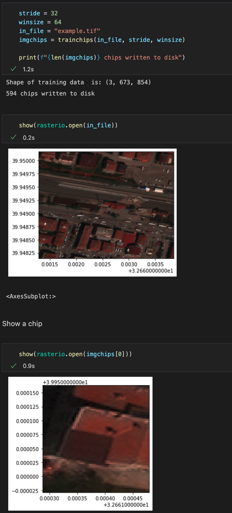

# GeoTagged_ImageChip
A simple script to create geo tagged image chips from high resolution RS images for training deep learning models. Fork of [Hejarshahabi/GeoTagged_ImageChip](https://github.com/Hejarshahabi/GeoTagged_ImageChip) but simplified to not handle a label file, and example tif provided

## Setup
* `python3 -m venv venv`
* `source venv/bin/activate`
* `pip install -r requirements.txt`
* Run the notebook